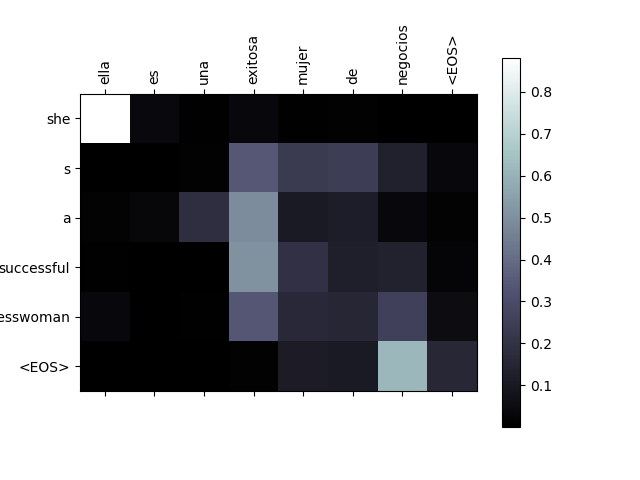

# Seq2Seq Neural Machine Translation with Attention
 
An implementation of a sequence-to-sequence neural machine translation model with an attention mechanism, applied to English-Spanish translation.
 
## Overview
 
This project builds a character-aware, attention-based encoder-decoder network that learns to translate English sentences into Spanish. The attention mechanism allows the decoder to focus on relevant parts of the input sequence at each decoding step, rather than compressing the entire input into a single fixed-length vector — a key advancement over vanilla seq2seq models.
 
The model is trained on the [Tatoeba](https://tatoeba.org/) English-Spanish sentence pairs dataset.
 
## How It Works
 
### Architecture
 
- **Encoder:** A GRU-based RNN that reads the input sentence word by word and produces a sequence of hidden states
- **Attention Decoder:** At each decoding step, computes attention weights over all encoder outputs to determine which input words to focus on, then uses a weighted combination of those outputs to generate the next word
- **Vocabulary:** Built dynamically from the training corpus, mapping each unique word to an index
 
### Attention Mechanism
 
The attention weights are learned — the model figures out on its own which source words are most relevant when producing each target word. This can be visualized as a heatmap matrix, where bright cells indicate high attention between an input and output word pair.
 

 
## Dataset & Preprocessing
 
- Source: `eng-spa.txt` — tab-separated English/Spanish sentence pairs from Tatoeba
- Filtered to sentence pairs under a maximum token length to keep training tractable
- Normalized for punctuation and lowercased during preprocessing
 
## Training
 
- Optimizer: SGD with teacher forcing
- Loss: Negative log likelihood
- Hardware: Trained on a remote Linux instance via SSH
 
## Results
 
The model produces attention plots that show interpretable alignment between English input tokens and Spanish output tokens, consistent with expected translation behavior.
 
## Key Concepts Demonstrated
 
- Encoder-decoder architecture for sequence transduction
- Bahdanau-style additive attention
- Teacher forcing during training
- Vocabulary indexing and OOV handling
- Visualization of learned attention weights with matplotlib
 
## Reference
 
Based on the PyTorch intermediate tutorial [NLP From Scratch: Translation with a Sequence to Sequence Network and Attention](https://docs.pytorch.org/tutorials/intermediate/seq2seq_translation_tutorial.html), extended to support English-Spanish translation.
 
## Requirements
 
```
torch
numpy
matplotlib
```
